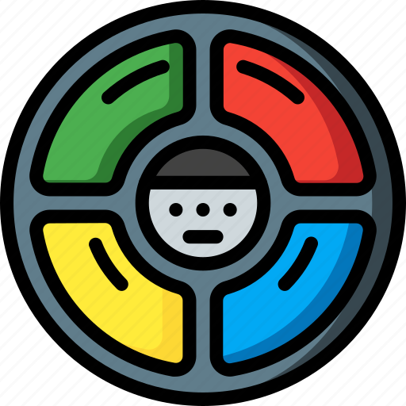

# SIMON

### Simon is a classic short term memory skill based game.

### The game makes a sequence of lights and sounds and requires a player to repeat the order. If the player succeeds, the sequence becomes progressively longer. Once the player misses the game is over!

 

#### This Simon clone is a version created so you can play right here in your browser!

 

#### To start playing, [Click Here!](https://evrook.github.io/Front-End-Game/) 

 

## Rules:

---

#### If you arer unfamilliar with how Simon is played.

- When the game starts, the computer will flash a random color.
- Click the same color the computer flashed.
- if you click the wrong color you lose!
    - Round 1 Win example:
        - Computer: 
            'Red'
        - Player: 
            'Red'
    - Round 1 Loss example:
        - Computer: 
            'Red'
        - Player: 
            'Green'
- Each round the computer will add another color to the end of what it's already chosen.
- Click the colors the computer chose in the same order.
- At any point you click out of order you lose!
    - Round 2 Win example: 
        - Computer:
            'Red'
            'Yellow'
        - Player:
            'Red'
            'Yellow'
     - Round 2 loss example: 
        - Computer:
            'Red'
            'Yellow'
        - Player:
            'Red'
            'Green'
- The game continues untill you miss a color.

 

## Later Additions:
---
- Aditional Game Modes.
    - ex: A mode where time between light sequence progressivly shortens. 
- High Score remains if you refresh
- Time Based Scoring

 

## Technologies Used:
---
- HTML
- CSS
- Javascript

 

## Sources:
---
- [Simon Wiki](https://en.wikipedia.org/wiki/Simon_(game)) (Rules & Description)
- [freesound.org](https://freesound.org/) (Audio Clips)
- [transparenttextures.com](https://www.transparenttextures.com/) (CSS textures)

 

## Contributions
---
- [Source Code](https://github.com/evRook/Front-End-Game)
- [Issue Tracker](https://github.com/evRook/Front-End-Game/issues)

